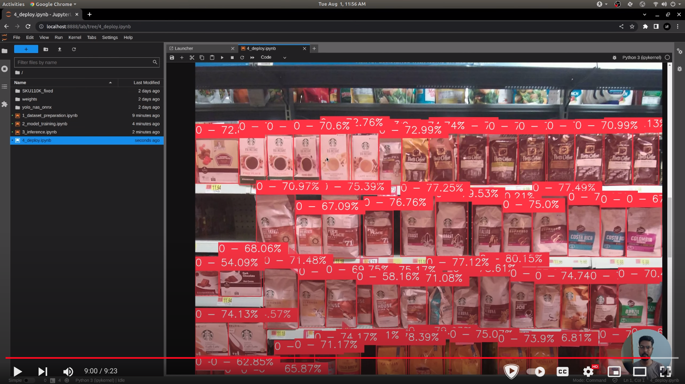

### YOLO NAS Retail Product Detection

This repository focuses on training a YOLO NAS model for detecting product items from shelf images in a retail environment. Additionally you can also find the ONNX model and inference code for the same in this repository.

> The dataset used for training can be found here [SKU110K](https://www.kaggle.com/datasets/thedatasith/sku110k-annotations)

Accompanying [Youtube Video](https://youtu.be/rlRPx8Sr914):

